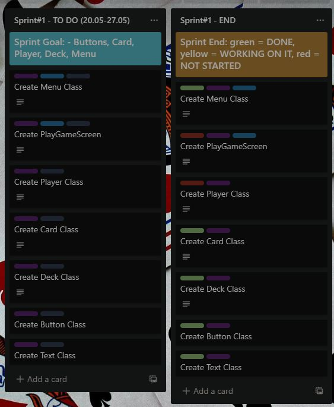
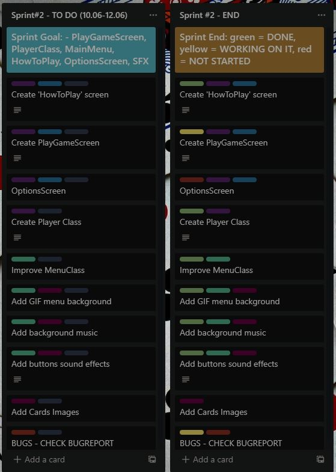
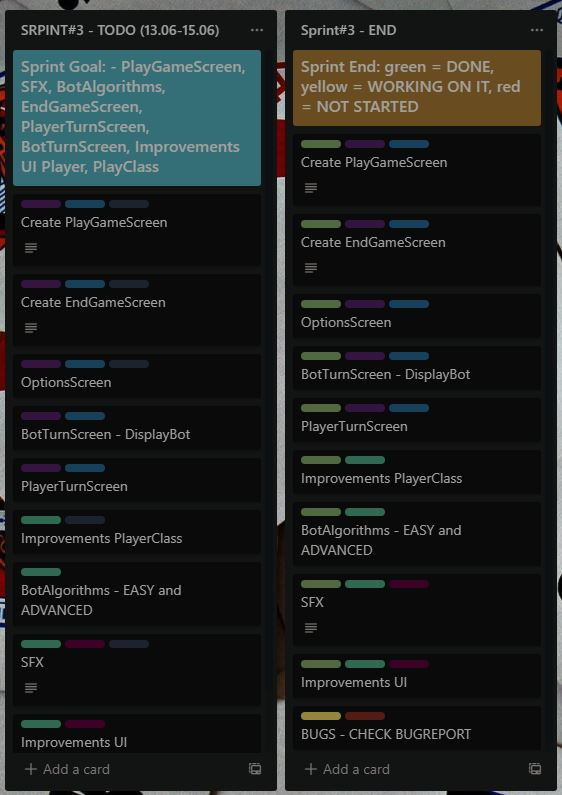
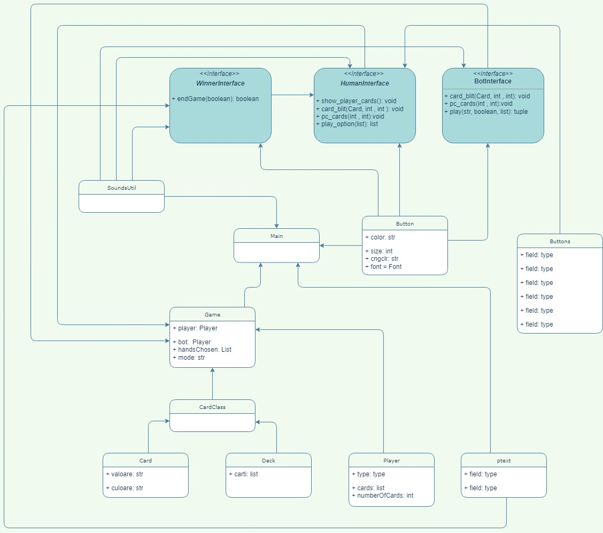

# MDS-Project
`Software Development Methods` - Project - 2nd year of University - Faculty of Mathematics and Informatics at the University of Bucharest

## Project team:

- **[Capmare Alex](https://github.com/CapmareAlex)**
- **[Butelca Radu](https://github.com/abradu28)**
- **[Fritz Raluca](https://github.com/ralucafritz)**
- **[Rotaru Radu](https://github.com/radu-rotaru)**
- **[Visalon Giani](https://github.com/Giani2001)**

---

## Table of Contents

[1. Project Description](#project-description)   
[2. Application demo](#application-demo)  
[3. Backlog](#backlog)  
[4. User Stories](#user-stories)  
[5. Bug Reporting](#bug-reporting)  
[6. UML Diagram](#uml-diagram)  
[7. Sourse Control](#source-control)  
[8. Code refactoring](#code-refactoring)   
[9. Design Patterns](#design-patterns)  

---

## Project Description

The idea behind this project was a simple one, to create a PC game similar to the card game "Minti", where you have to be careful with what you are saying in order to win. To make it easier to understand, you can think of it as a simpler version of poker, without some types of hands(flush or color).

The rules of the game:
   - the last one standing at the table is the winner(there is no such thing as a draw)
   - if someone has 6 cards, he/she loses
   - at the start of the game, the first player has to say a hand that he thinks(or not) can be formed from all of the cards dealt at the table. But he can choose any hand, even if he does not have even one card from that hand. He can do this to mislead the next player
   - the next player has two options: to say that the last player lied or to continue the game in the same manner as the last player, but saying a hand greater than him. If he considers that the last player lied, all the players show their cards and if the last hand can be formed from those cards, the cards are dealt again and the current player receives a card more than the last time, otherwise, if the hand cannot be formed, the last player receives one extra card.
   - the hands of the game are: one card, two of a kind, three of a kind, four of a kind.

Currently the application is only singleplayer(playing against the computer), with two levels of difficulty: __easy__ and __advanced__.
Future updates may implement multiplayer mode.

## Application demo 
The demo can be found on [Youtube/CapmareAlex](https://youtu.be/mdgEK8j4QsA).

## Backlog

### Sprint #1 

### Sprint #2 

### Sprint #3 


## User Stories

- As a `player`, I want to play a simple card game without bugs.
- As a `player`, I want a variety of difficulty options to choose from.
- As a `player`, I appreciate decent sound effects and graphics.
- As a `player`, I want a simple UI so that I can find my way around the game.
- As a `player`, I want a game that is not repetitive.
- As a `player`, I want a game report after I finish a game to find out where I can improve my gameplay.
- As a `player`, I want to play games that challenge me.
- As a `player`, I want to have fun when playing games, and that means winning.
- As a `player`, I want to play games that require using only my mouse so that my boss doesn't figure out I'm playing during my work-hours.
- As a `game tester`, I want to test multiple scenarios in order to report possible bugs to the dev team.
- As a `blog writer`, I want to find card games I can write articles about for card games fans.
- As a `member of the developer team`, I want to have easy ways to communicate with my team in order to work faster and easier.
- As a `scrum master`, I want my team to do their tasks properly and in the specified timeframe so that we receive positive feedback from the client.
- As a `client`, I want fast and good results from the developer team.

## Bug Reporting

During implementation, the project has suffered multiple changes in order to function without bugs. Here are some of the bugs that we've found and tried to solve:

1. **Card selection bug**
   - the problem was found when trying to select cards
   - before a card is chosen, all cards are black, and after selection, the card selected is turned to a white one
   - the problem was that we could select multiple cards at once, but we wanted to be able to select only one card
   - to solve this problem, we stored the colors of the cards before pressing them and when one card was pressed, we changed its color to white. But only a card from the list could be white, if we wanted to change the selected card, we firstly had to deselect the white card(transforming it back to black) and select another one.

2. **Sound bug when trying to flip multiple cards**
   - it occurs when you select a card and you start clicking fast on another card that is not flipped
   - this bug is still _**not resolved**_.

3. **Sound bug when pressing on `Play`**
   - when pressing `Play`, the cards shuffle sound and the sound for pressing a button overlap and after both of them are finished, the screen changes
   - the main idea behind adding the shuffle cards sound was that the sound effect should be playing after the screen changes, followed by a delay in showing the UI elements
   - this bug is still _**not resolved**_.

4. **Displaying the wrong number of cards**
   - the problem was found when trying to select cards
   - when selecting the number of cards of a type, the number of cards displayed was not always the same as the one pressed by the user
   - the problem was that the selection area for those buttons was not the same as the area of the button itself, and sometimes the wrong input was chosen
   - to solve the problem, we've updated the selection areas of the buttons to be the same as the are of buttons that they represented
   
## UML Diagram



## Source Control

**Branches:** https://github.com/CapmareAlex/MDS-Project/branches
  - _branch-alex-capmare_ - contains the workspace used by **[Capmare Alex](https://github.com/CapmareAlex)**
  - _branch-raluca-fritz_  - contains the workspace used by **[Fritz Raluca](https://github.com/ralucafritz)**
  - _branch-radu-rotaru_  - contains the workspace used by **[Rotaru Radu](https://github.com/radu-rotaru)**
  - _branch-giani-visalon_  - contains the workspace used by **[Visalon Giani](https://github.com/Giani2001)**

**Commits:** https://github.com/CapmareAlex/MDS-Project/commits/main

## Code refactoring
We have made many improvements to our code along the way, a few of the most recent ones are:

1. The sound effects and music have been moved to a new class called `SoundsUtil` where they are initalized and have their specific methods to 
   - play 
   - pause 
   - unpause
   - mute
   - unmute 
   - setvolume etc.

    ```python
        def buttonClickSoundPlay():
            buttonClickSound.play()
        def cardClickSoundPlay():
            cardClickSound.play()
        def shuffleSoundPlay():
            shuffleSound.play()
        .
        .
        .
        def musicPlay():
            pygame.mixer.music.play(-1)
        def musicPause():
            pygame.mixer.music.pause()
        def musicUnpause():
            pygame.mixer.music.unpause()
        def musicStop():
            pygame.mixer.music.fadeout(20)
    ```
Those changes were made in this [commit](https://github.com/CapmareAlex/CardGame/commit/c43bea2aa0e6866e2363860584a429bf6aa3d497).

2. There was a double if statement that checked if any button was pressed that as repeating in the `main.py` class. If the button was pressed in the main menu, the game would close. If the button was pressed in the menus `How To Play` or `Options`, you would be sent back to the main menu.   
To avoid the repetive behaviour of those statements, we have implemented a method that returns the value `True` when a button is pressed.  
``` python
    def checkIfQuit():
        for event in pygame.event.get():
            if event.type == pygame.QUIT:
                return True
            if event.type == pygame.KEYDOWN:
                return True
```
This method is being used in 2 other methods in `main.py`, to check the  interruption the loop of specific screens, and once in the main code in `main.py` to check the interruption or end or the entire application.  
 
Those changes were made in this [commit](https://github.com/CapmareAlex/CardGame/commit/f8c5179f3fd6af09a610e5097f2d7356604acf4d).


## Design Patterns

A design pattern is a description of a solution or a template which can be used to solve a problem.
In our game the main design pattern used was the User Interface, in which we have implemented the classes that define the game, the Player class which stores the cards of the user and provides him with actions to perform, and DisplayBot class which simulates a real player by trying to calculate the decision that the PC is going to make in a given state of the game.
These two classes were added to the graphical interface of the game, where we can play against the computer who can choose to continue the game or to say that the user is lying.
